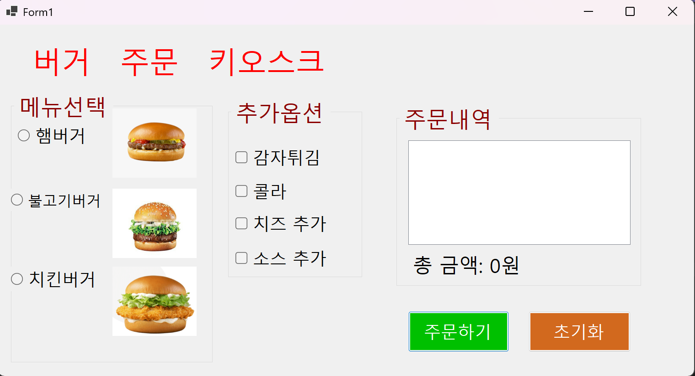
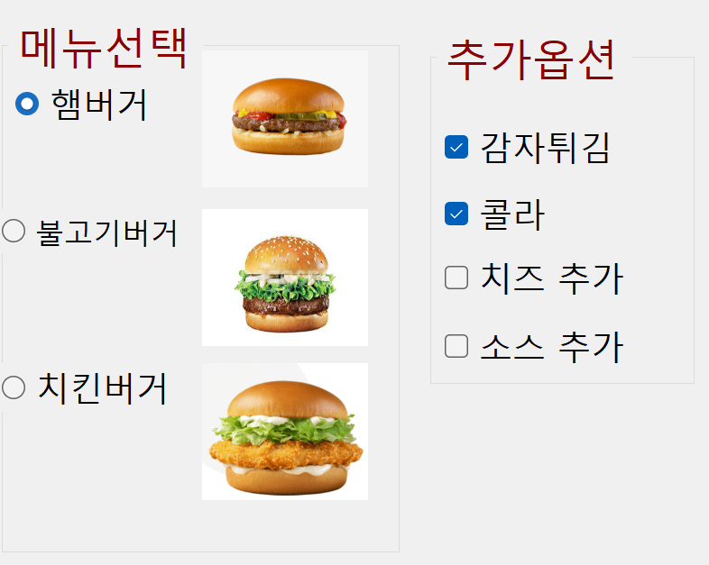
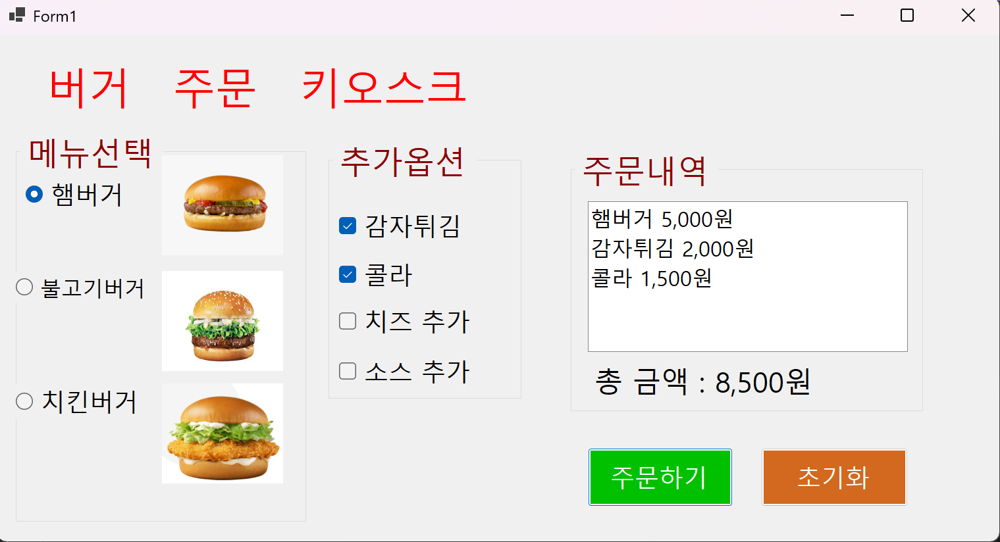
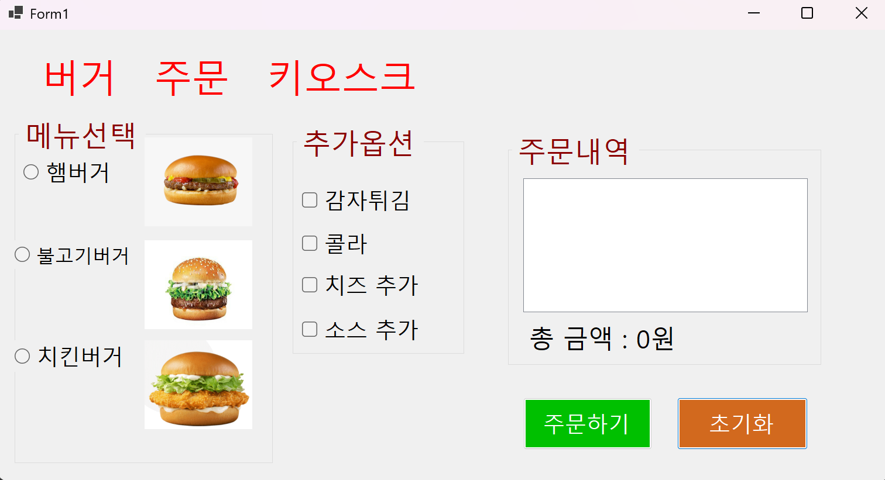
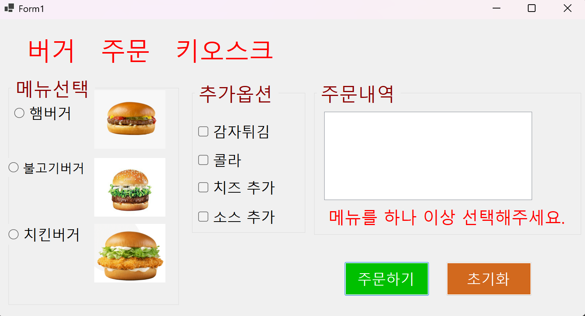
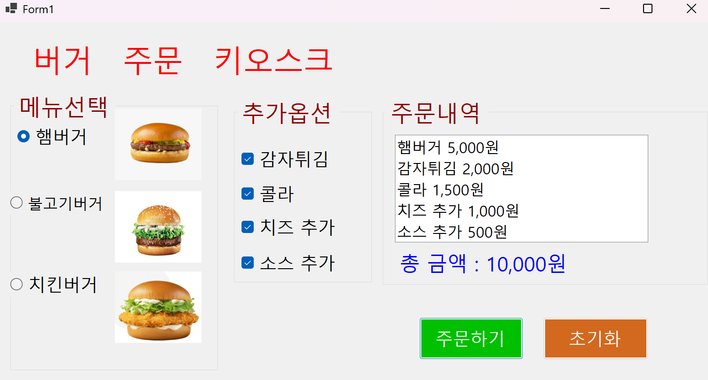

(C# 코딩)버거 주문 키오스크 (Burger Kiosk)

## 개요
- C# 프로그래밍 학습
- 1줄 소개: 사용자로부터 주문을 입력받아 최종 가격고지와 주문을 하는 Windows Forms 기반 로그인 프로그램
- 사용한 플랫폼:
	- C#, .NET Windows Forms, Visual Studio, GitHub
- 사용한 컨트롤:
 
	- Label → 메뉴 안내, 총 금액, 상태 메시지 등을 표시하여 사용자가 현재 주문 상황을 쉽게 확인할 수 있도록 한다.

	- TextBox → 수량 입력, 검색 기능, 또는 결제 금액 표시 등 사용자 입력 및 데이터 표시 용도로 사용된다.

	- Button → 메뉴 선택, 주문 추가, 삭제, 결제 진행 등 키오스크의 주요 기능을 실행하는 인터랙션 요소로 사용된다.

	- ListBox → 사용자가 선택한 메뉴 목록과 주문 내역을 출력하여 전체 주문 상태를 한눈에 확인할 수 있도록 한다.

- 사용한 기술과 구현한 기능
	- Visual Studio를 이용하여 키오스크 UI를 구성함
	- 버튼 클릭 이벤트를 통해 메뉴 선택, 주문 추가 및 삭제 기능을 구현하였다.
	- ListBox를 사용하여 주문 내역을 실시간으로 출력하고 관리할 수 있도록 하였다.
	- 선택한 메뉴의 가격을 기반으로 총 금액이 자동 계산되도록 로직을 구현하였다.
	- 입력값 검증 및 예외 처리를 통해 잘못된 입력이나 동작을 방지하도록 설계하였다.

- 수업 중에 배우고 사용했던 클래스들 관련된 설명

- 실습 중에 구현한 기능들 설명

## 실행 화면 (과제1)
- 코드의 실행 스크린샷과 구현 내용 설명

	- 초기화면

	- 메뉴는  RadioButton (그룹에서 1개만 선택가능)
	- 추가옵션은 CheckBox (다중 선택가능)

	- 주문하기 버튼 클릭 시 주문 내역과 총 금액이 ListBox에 출력됨

	- 초기화 버튼 클릭 시 주문 내역과 총 금액이 초기화됨

- 과제 내용
	- 메뉴는 3가지 (햄버거, 치즈버거, 콜라)
	- 추가옵션은 3가지 (감자튀김, 치즈스틱, 아이스크림)
	- 주문하기 버튼 클릭 시 주문 내역과 총 금액이 ListBox에 출력됨
	- 초기화 버튼 클릭 시 주문 내역과 총 금액이 초기화됨

- 구현 내용과 기능 설명
	- 메뉴 선택과 추가 옵션 선택을 통해 주문 내역이 ListBox에 출력되고, 총 금액이 계산되어 표시되는 기능을 구현하였다.
	- 초기화 버튼을 클릭하면 주문 내역과 총 금액이 초기화되어 사용자가 새로운 주문을 시작할 수 있도록 하였다.

## 실행 화면 (과제2)
- 코드의 실행 스크린샷과 구현 내용 설명

	- 메뉴나 추가옵션중 아무것도 선택하지 않고 주문하기 버튼 클릭 시 예외처리 메시지 출력

- 코드의 실행 스크린샷과 구현 내용 설명
-
	- 초기화 한 후 재주문을 하거나 예외처리 메시지가 떠 있는 상태에서도 재주문 가능

- 과제 내용
	- 메뉴나 추가옵션중 아무것도 선택하지 않고 주문하기 버튼 클릭 시 예외처리 메시지 출력

- 구현 내용과 기능 설명
	- 메뉴나 추가 옵션이 선택되지 않은 상태에서 주문하기 버튼을 클릭하면 예외처리 메시지가 출력되도록 구현하였다. 또한, 초기화 버튼을 클릭한 후에도 재주문이 가능하도록 하여 사용자가 계속해서 주문을 진행할 수 있도록 하였다.